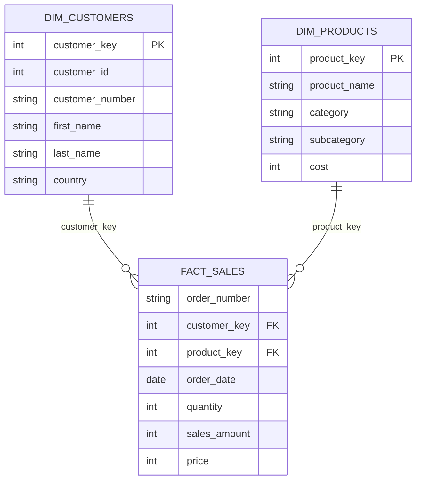

# SQL-Retail-Business-Analysis-Project

End-to-end SQL project using PostgreSQL to analyze retail sales data through exploratory analysis, customer segmentation, product performance, revenue insights, CTEs, window functions, and business reporting.

1. Project Overview:-
 - Retail businesses generate thousands of transactions every day. While transactional data is valuable, meaningful business decisions require transforming this raw data into actionable insights.
 - This project demonstrates how SQL can be used to analyze retail sales data by exploring customer behavior, sales performance, product trends, and revenue generation.
 - The project showcases practical SQL techniques commonly used by Data Analysts and Business Analysts.

2. Business Problem:-
Business stakeholders need answers to questions such as:
- Are sales improving over time?
- Which customers generate the highest revenue?
- Which products perform the best?
- Which categories contribute the most revenue?
- How do customers differ in purchasing behavior?
- Which business areas require attention?
This project answers these questions using SQL

3. Objectives:-
- Perform exploratory data analysis
- Analyze sales performance
- Evaluate product performance
- Understand customer purchasing behavior
- Generate business reports
- Apply advanced SQL techniques

4. Dataset
--------------------------------------------------------------------------------
TABLE NAME                 DESCRIPTION
--------------------------------------------------------------------------------
gold.dim_customers         Customer demographic information

gold.dim_products          Product details including category and cost

gold.fact_sales            Transaction-level sales records linking customers,
                           products, orders, quantity, price and sales amount

5. DataBase Schema
The project uses a **star schema** consisting of one fact table (`fact_sales`) and two dimension tables (`dim_customers` and `dim_products`).

- `dim_customers` stores customer demographic information.
- `dim_products` stores product details and categories.
- `fact_sales` records transaction-level sales and links customers with products through foreign keys.

6. Database Relationship

