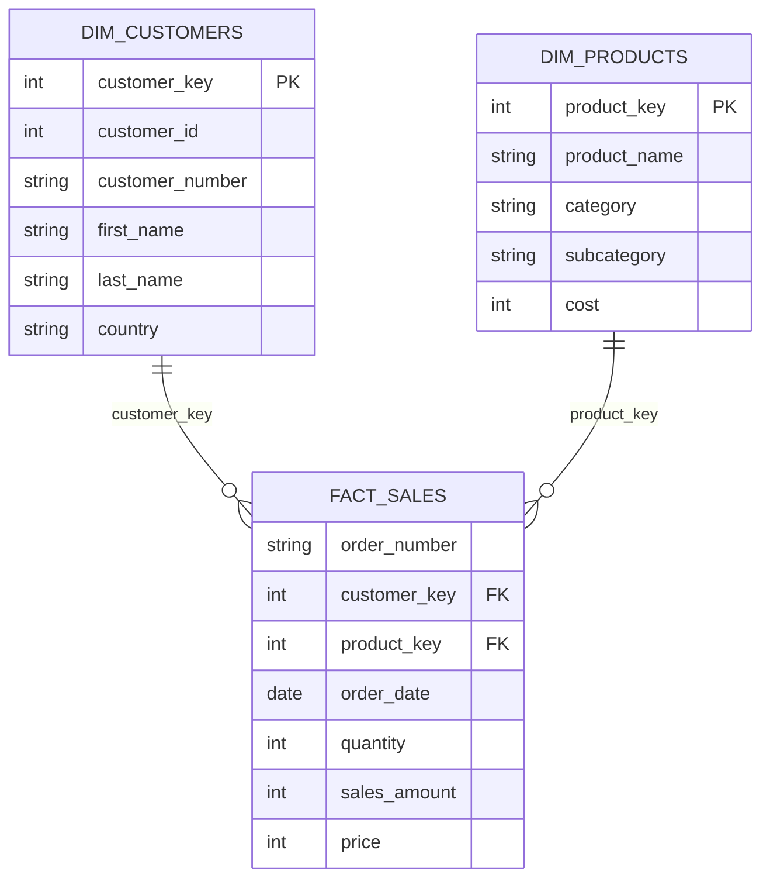

# SQL - Retail Sales Analysis using SQL
An end-to-end SQL analytics project built using PostgreSQL to analyze retail sales data, uncover customer and product insights, and generate business-oriented reports using advanced SQL techniques.

## Table of Contents
1. Project Overview
2. Business Problem
3. Objectives
4. Dataset
5. Database Schema
6. Tools Used
7. Skills Demonstrated
8. Key Analyses
9. Business Questions
10. SQL Concepts
11. Key Insights

## 1. Project Overview
 - Retail businesses generate thousands of transactions every day. While transactional data is valuable, meaningful business decisions require transforming this raw data into actionable insights.
 - This project demonstrates how SQL can be used to analyze retail sales data by exploring customer behavior, sales performance, product trends, and revenue generation.
 - The project showcases practical SQL techniques commonly used by Data Analysts and Business Analysts.

## 2. Business Problem
Business stakeholders need answers to questions such as:
- Are sales improving over time?
- Which customers generate the highest revenue?
- Which products perform the best?
- Which categories contribute the most revenue?
- How do customers differ in purchasing behavior?
- Which business areas require attention?
This project answers these questions using SQL

## 3. Objectives
- Perform exploratory data analysis
- Analyze sales performance
- Evaluate product performance
- Understand customer purchasing behavior
- Generate business reports
- Apply advanced SQL techniques

## 4. Dataset Overview
The project uses a retail sales database consisting of three related tables.

| Table | Description |
|-------|-------------|
| `gold.dim_customers` | Customer demographic information including customer details, gender, country, and account creation date. |
| `gold.dim_products` | Product information including product name, category, subcategory, product line, and cost. |
| `gold.fact_sales` | Transaction-level sales records linking customers and products, including order details, quantity sold, price, and sales amount. |

## 5. Database Schema
The project uses a **star schema** consisting of one fact table (`fact_sales`) and two dimension tables (`dim_customers` and `dim_products`).

- `dim_customers` stores customer demographic information.
- `dim_products` stores product details and categories.
- `fact_sales` records transaction-level sales and links customers with products through foreign keys.



## 6. Tools Used
- PostgreSQL
- SQL
- pgAdmin
- Window Functions
- Aggregate Functions
- Common Table Expressions (CTEs)
- Ranking Functions

## 7. Skills Demonstrated
- SQL Joins
- GROUP BY
- Aggregate Functions
- CASE Statements
- Common Table Expressions (CTEs)
- Window Functions
- Ranking Functions
- Date Functions
- Business Reporting
- Customer Analytics

## 8. Key Analysis
- Sales Trend Analysis
- Monthly Revenue Analysis
- Customer Segmentation
- Top Customers
- Product Performance
- Category Performance
- Sales Ranking
- Running Totals
- Moving Average
- Revenue Contribution

## 9. Business Questions Addressed
- Which customers contribute the highest revenue?
- Which products sell the most?
- Which product categories perform best?
- What are the monthly sales trends?
- Which countries generate the highest sales?
- What is the average order value?
- Which products have the highest revenue?

## 10. SQL Techniques Used
- SELECT
- WHERE
- ORDER BY
- GROUP BY
- HAVING
- CASE
- JOINS
- CTEs
- Window Functions
- ROW_NUMBER()
- RANK()
- DENSE_RANK()
- SUM() OVER()
- AVG() OVER()
- COUNT()
- Aggregate Functions

## 11. Key Insights
- A small percentage of customers contribute a significant portion of total revenue.
- Certain product categories consistently outperform others.
- Monthly sales exhibit seasonal trends.
- Revenue is concentrated among a limited number of high-performing products.
- Customer purchasing behavior varies across demographic groups.

## NOTE:
Project Setup
1. Clone the repository.
2. Create the PostgreSQL database.
3. Execute the database creation script.
4. Import the CSV files.
5. Run the SQL analysis scripts.

Repository Structure

```text
sql-retail-sales-analysis/
│
├── datasets/
│   ├── dim_customers.csv
│   ├── dim_products.csv
│   └── fact_sales.csv
│
├── README.md
└── retail_sales_analysis.sql
```


